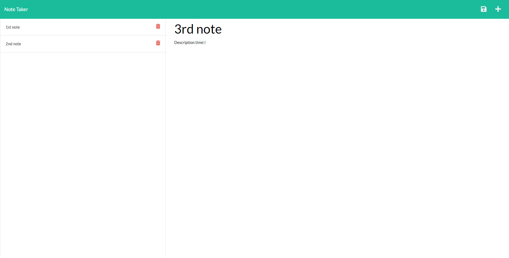

# 11-Note-Taker

## Description

This application was created to help you have a place to create, store, and delete notes for reminders to yourself, class_notes, etc. Start by clicking the Add button at the top right corner, type the title and content of your note, and click the save button in order to save your notes. If you want to view notes you have saved, simply select them. If you would like to delete a note, use the delete button. Use this as your one stop shop for all your notes.

## Table of Contents

- [Installation](#installation)
- [Usage](#usage)
- [License](#license)
- [Questions](#questions)

## Installation

- Download the github repository.
- Navigate into the folder using the terminal.
- Run "npm i" to install Express and UUID.
- Run the command  "node server.js" and open the url that the console shows.
- Use the Note taker app.

## Usage

- Click the "+" button at the top right to start a new note.
- After you have filled out your note, click the save button at the top right next to the "+" button.
- If you would like to look at past notes, click on the note on the right window
- If you would like to delete a note, click the delete button next to the note.

## License

GNU General Public License v3.0

---

## Badges

## Questions

If you have any questions visit my github at [https://github.com/Verzo361219](https://github.com/Verzo361219) or email me at michaelhobbs361219@gmail.com

## Deployed Application

### Screenshot

You can find the application deployed at the following Heroku Link:
- [https://dry-waters-78588.herokuapp.com](https://dry-waters-78588.herokuapp.com)